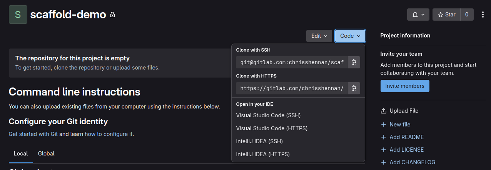
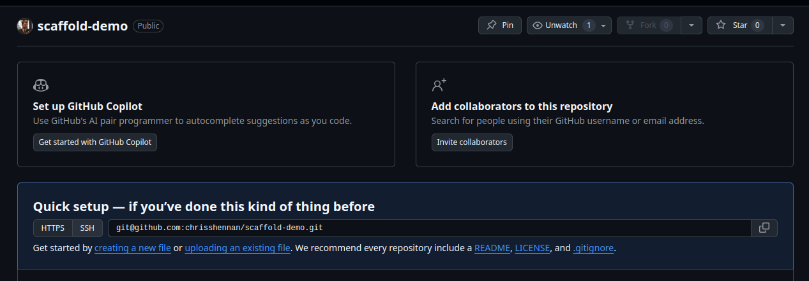

# Scaffold

A Symfony & Tailwind CSS boilerplate for developing your next big project.

[TOC]

## Quickstart

### Requirements

- Docker / Docker Compose

### Pre-requisite

Create an empty repository to hold your new project and copy the repository URL i.e.

>Note: **Scaffold** has a CI pipeline for GitLab but not one for GitHub (yet).

#### Via GitLab



#### Via GitHub



### Initialize the project

Clone the `scaffold` project, initialize it and complete the setup prompts.  You only need to do this step once.

> **Note**: When asked `What is your git repository origin for this new project?`, enter the repository URL you copied in the step above.

```
# Clone the repo
git clone https://github.com/chrisshennan/scaffold.git scaffold

# Initialize the project
cd scaffold
make initialize
```

### Starting the Scaffold development environment
You can start the development environment via
```
make start
```

This will start the containers defined in the `compose.yaml` file.

You should now be able to open a browser and go to http://localhost and see the scaffold homepage.

> **Note**: `make initialize` runs `make start` automatically so you won't need this step first time round.

### First commit
Push the project to your new repository via

```
git push origin main
```

### Start Building

That’s it! You’re all set to start developing your project just like any other Symfony project, with some extra perks:

- Tailwind CSS pre-integrated for streamlined styling.
- A Docker development environment complete with Xdebug and Composer.
- A Makefile to simplify running common tasks.

----

## Makefile

**Scaffold** includes a `Makefile` to help run common tasks, a few of the key ones you will need fairly quickly are 

- Start / stop the development environment
```bash
make start
make stop
```

- Watch for CSS and HTML changes and rebuild the Tailwind CSS files
```bash
make tailwind-watch
```

- Update composer vendor packages
```bash
make composer update
```


- To get a full list of available helper command run

```bash
make help
```

## Further Reading
At this point, you have a functional **Scaffold** project up and running, ready for you to start developing your application. However, this is just the beginning—there’s much more to explore and take advantage of with Scaffold.

- [Developer Tools (xdebug, PHP CS Fixer, PHPStan)](./docs/configuration/developer-tools.md)

And to make sure you keep up-to-date with the latest developments you can [subscribing to my newsletter](https://newsletter.chrisshennan.com/subscribe).

## Thank you

Thank you for your interest in **Scaffold**!

I’m excited to hear how you’re using **Scaffold** and would love your feedback. Whether you have comments, suggestions, ideas, or improvements, don’t hesitate to reach out—I value your input and look forward to hearing from you!

Chris Shennan<br/>https://chrisshennan.com